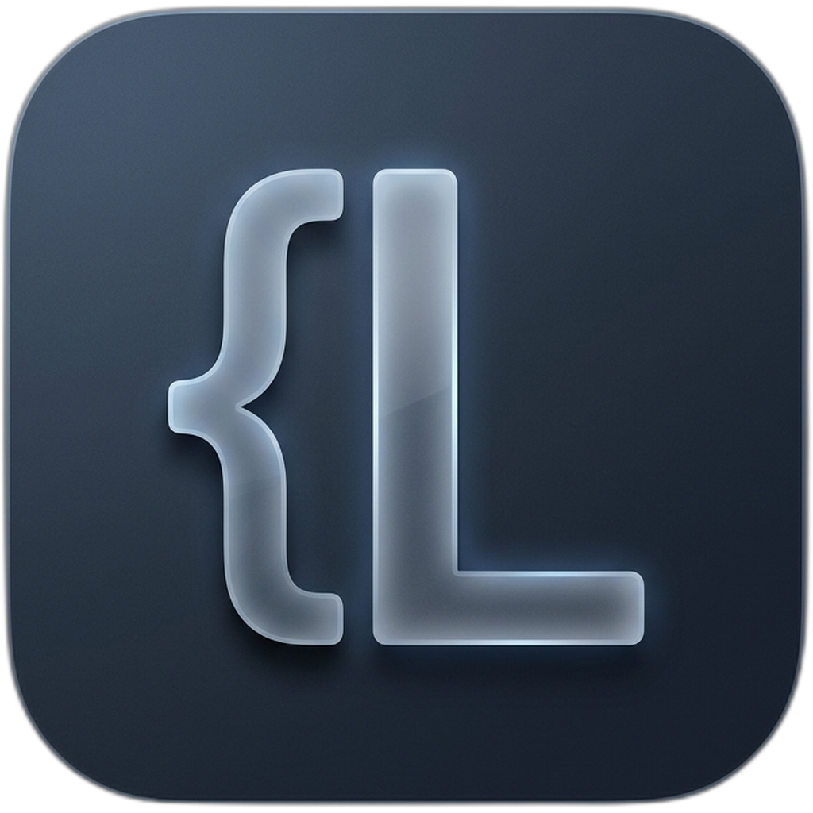

# Luce — Modern, Lightweight Code Editor

<p align="center">
  
</p>

<p align="center">
  <strong>Luce</strong> is a lightweight, GPU-accelerated desktop code editor written in <strong>C++23</strong> using <a href="https://github.com/ocornut/imgui">Dear ImGui</a>, <a href="https://www.libsdl.org/">SDL2</a>, and OpenGL 3.3. It delivers a fast, responsive native editing experience with rich SVG file icons, Live Markdown Preview, Git integration, an embedded terminal, and a Lua 5.4 plugin engine.
</p>

<p align="center">
  <a href="https://github.com/luce-editor/luce/releases"></a>
  
  
  <a href="LICENSE"></a>
  <a href="https://luce-editor.github.io/luce/"></a>
</p>

---

## Highlights

- **GPU-Accelerated Native Engine**: Ultra-low latency, virtual scrolling, and high frame rates powered by Dear ImGui (docking branch) and OpenGL 3.3.
- **Modern Dark Aesthetics**: Sleek dark color palette, native SVG vector icons for files and folders, and crisp monospace typography (Lilex & IBM Plex Sans).
- **Drag & Drop & Split View**: Side-by-side editing (`Ctrl+\`), smooth tab reordering, and intuitive drop zones across editor panes and file tree.
- **Live Markdown Preview**: Side-by-side formatted preview with headings, bold text, lists, and code blocks (`Ctrl+Shift+M`).
- **Git Gutter & Visual Diff Viewer**: Line-by-line diff markers in the gutter (added, modified, deleted) and built-in syntax-highlighted unified diff viewer.
- **Command Palette & Project Search**: Fast fuzzy file finder (`Ctrl+P`), command palette (`Ctrl+Shift+P`), and project-wide search (`Ctrl+Shift+F`) with instant line jumping.
- **Embedded Terminal**: Multi-tab terminal with VT100 emulation running PowerShell, Command Prompt, or Bash (`Ctrl+` `).
- **Extensible Lua 5.4 Plugin Engine**: Script custom commands, document lifecycle hooks (`before_save`, `text_changed`), diagnostics/linters, and custom autocomplete providers with zero compilation needed.
- **Syntax Highlighting & Emmet**: Handcrafted deterministic lexers for C/C++, Rust, HTML/CSS/JS, Markdown, CMake, and HTML Emmet expansion (`Tab`).

---

## Installation & Download

### Windows

Pre-built binaries are available in the [GitHub Releases](https://github.com/luce-editor/luce/releases) section:

- **Windows Installer (`Luce-Setup-x64.exe`)**:
  - Per-user installation (no administrator privileges required).
  - Windows Explorer context menu integration (*"Open with Luce"*).
  - Adds `luce` to system `PATH` for quick terminal launching (`luce .`).
  - Desktop and Start Menu shortcuts.
- **Portable Package (`Luce-win64-portable.zip`)**:
  - Run directly without installation. Settings and sessions are stored portably next to the executable.

### Building from Source

```powershell
# Clone repository
git clone https://github.com/luce-editor/luce.git
cd luce

# Configure and build Release
cmake -B build
cmake --build build --config Release

# Run
.\build\Release\luce.exe
```

For Linux build instructions and requirements, see the [Installation Guide](https://luce-editor.github.io/luce/docs/installation).

---

## Documentation

Full documentation, guides, and tutorials are available on the [Luce Documentation Site](https://luce-editor.github.io/luce/):

- [Getting Started](https://luce-editor.github.io/luce/docs/intro)
- [Installation & Setup](https://luce-editor.github.io/luce/docs/installation)
- [Keyboard Shortcuts Reference](https://luce-editor.github.io/luce/docs/interface/keyboard-shortcuts)
- [Lua Plugin Development](https://luce-editor.github.io/luce/docs/plugins/creating-a-plugin)
- [Lua API Reference](https://luce-editor.github.io/luce/docs/plugins/api-reference)
- [Engine Architecture](https://luce-editor.github.io/luce/docs/architecture)

---

## License

- **Luce Code Editor**: Licensed under [GNU General Public License v3.0 (GPLv3)](LICENSE).
- **Documentation Website**: Licensed under the [MIT License](docs-site/LICENSE).
- **Icons**: Derived from the [vscode-icons](https://github.com/vscode-icons/vscode-icons) project ([CC BY-SA 4.0](https://creativecommons.org/licenses/by-sa/4.0/)) and Google [Material Icons](https://fonts.google.com/icons) ([Apache 2.0](https://www.apache.org/licenses/LICENSE-2.0)).
